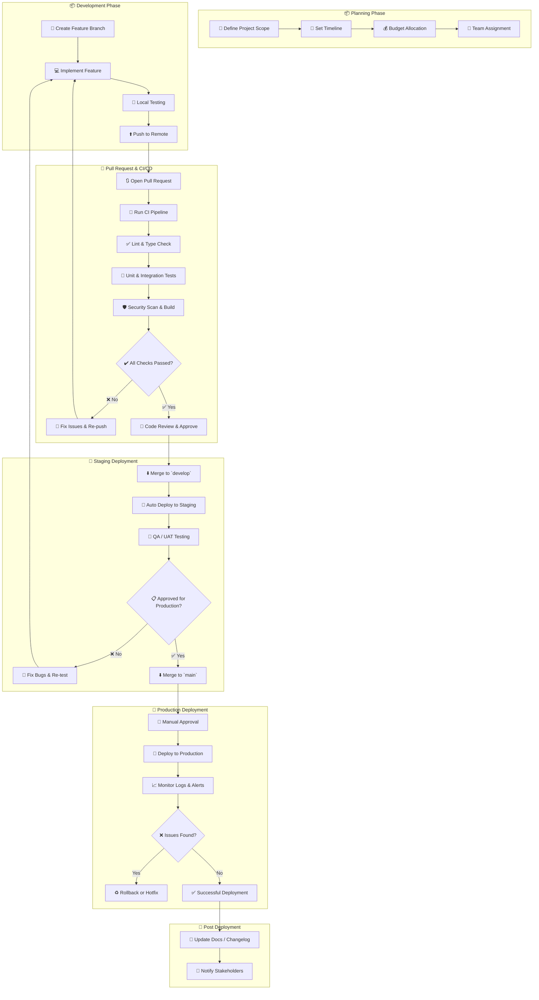

```mermaid 
flowchart TD

%% ================================
%% 📦 Planning Phase
%% ================================ 
subgraph PLAN [📦 Planning Phase]
    P1[📝 Define Project Scope]
    P2[📅 Set Timeline]
    P3[💰 Budget Allocation]
    P4[👥 Team Assignment]

    P1 --> P2 --> P3 --> P4
end

%% ================================
%% 📦 Development Phase
%% ================================
subgraph DEV [📦 Development Phase]
    A1[📁 Create Feature Branch]
    A2[💻 Implement Feature]
    A3[🧪 Local Testing]
    A4[⬆️ Push to Remote]

    A1 --> A2 --> A3 --> A4
end

%% ================================
%% 🔁 Pull Request & CI/CD
%% ================================
subgraph CI [🔁 Pull Request & CI/CD]
    B1[🔃 Open Pull Request]
    B2[🧪 Run CI Pipeline]
    B3[✅ Lint & Type Check]
    B4[🧪 Unit & Integration Tests]
    B5[🛡️ Security Scan & Build]
    B6{✔️ All Checks Passed?}
    B7[🔁 Fix Issues & Re-push]
    B8[👀 Code Review & Approve]

    A4 --> B1 --> B2 --> B3 --> B4 --> B5 --> B6
    B6 --❌ No --> B7 --> A2
    B6 --✅ Yes --> B8
end

%% ================================
%% 🚧 Staging Deployment
%% ================================
subgraph STG [🚧 Staging Deployment]
    C1[⬇️ Merge to `develop`]
    C2[🚀 Auto Deploy to Staging]
    C3[🧪 QA / UAT Testing]
    C4{📋 Approved for Production?}
    C5[🔧 Fix Bugs & Re-test]
    C6[⬇️ Merge to `main`]

    B8 --> C1 --> C2 --> C3 --> C4
    C4 --❌ No --> C5 --> A2
    C4 --✅ Yes --> C6
end

%% ================================
%% 🚀 Production Deployment
%% ================================
subgraph PROD [🚀 Production Deployment]
    D1[🧍 Manual Approval]
    D2[🚀 Deploy to Production]
    D3[📈 Monitor Logs & Alerts]
    D4{❌ Issues Found?}
    D5[♻️ Rollback or Hotfix]
    D6[✅ Successful Deployment]

    C6 --> D1 --> D2 --> D3 --> D4
    D4 --Yes --> D5
    D4 --No --> D6
end

%% ================================
%% 📝 Post Deployment
%% ================================
subgraph POST [📝 Post Deployment]
    E1[📄 Update Docs / Changelog]
    E2[📢 Notify Stakeholders]

    D6 --> E1 --> E2
end
``` 
