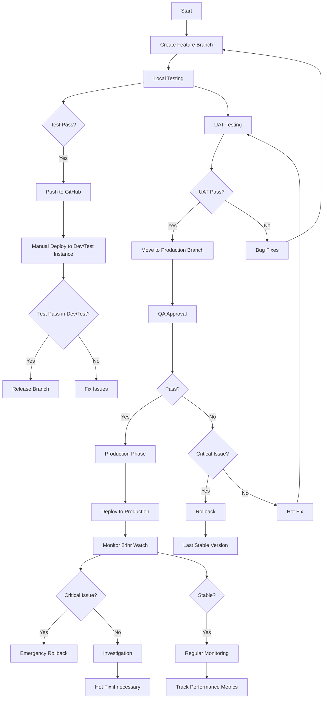

## Deployment Flow

```mermaid
graph TD
  A["Start"]
  A --> B["Create Feature Branch"]
  B --> C["Local Testing"]
  C --> D{"Test Pass?"}
  D -->|"Yes"| E["Push to GitHub"]
  E --> F["Manual Deploy to Dev/Test Instance"]
  F --> G{"Test Pass in Dev/Test?"}
  G -->|"Yes"| H["Release Branch"]
  G -->|"No"| I["Fix Issues"]
  C --> J["UAT Testing"]
  J --> K{"UAT Pass?"}
  K -->|"Yes"| L["Move to Production Branch"]
  L --> M["QA Approval"]
  M --> N{"Pass?"}
  N -->|"Yes"| O["Production Phase"]
  N -->|"No"| P{"Critical Issue?"}
  P -->|"Yes"| Q["Rollback"]
  Q --> R["Last Stable Version"]
  P -->|"No"| S["Hot Fix"]
  S --> J
  K -->|"No"| T["Bug Fixes"]
  T --> B
  O --> U["Deploy to Production"]
  U --> V["Monitor 24hr Watch"]
  V --> W{"Critical Issue?"}
  W -->|"Yes"| X["Emergency Rollback"]
  W -->|"No"| Y["Investigation"]
  Y --> Z["Hot Fix if necessary"]
  V --> AA{"Stable?"}
  AA -->|"Yes"| AB["Regular Monitoring"]
  AB --> AC["Track Performance Metrics"]
```
