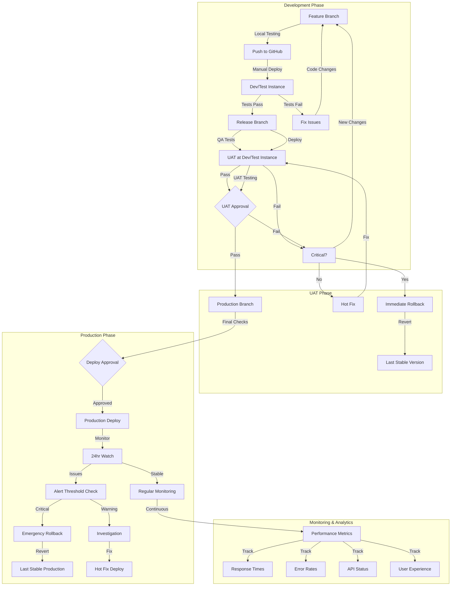

## Deployment Flow

```mermaid
graph TD
   subgraph Development Phase
        A[Feature Branch] -->|Local Testing| B[Push to GitHub]
        B -->|Manual Deploy| C[Dev/Test Instance]
        
        C -->|Tests Pass| E[Release Branch]
        C -->|Tests Fail| D[Fix Issues]
        
        D -->|Code Changes| A
        
        E -->|QA Tests| F{QA Approval}
        F -->|Pass| G[Proceed to Release]
        F -->|Fail| H[Bug Fixes]
        
        H -->|New Changes| A
    end

    subgraph UAT Phase
        E -->|Deploy| F[UAT at Dev/Test Instance]
        F -->|UAT Testing| G{UAT Approval}
        
        G -->|Fail| H[Critical?]
        H -->|Yes| I[Immediate Rollback]
        H -->|No| J[Hot Fix]
        
        I -->|Revert| K[Last Stable Version]
        J -->|Fix| F
        
        G -->|Pass| L[Production Branch]
    end

    subgraph Production Phase
        L -->|Final Checks| M{Deploy Approval}
        M -->|Approved| N[Production Deploy]
        
        N -->|Monitor| O[24hr Watch]
        O -->|Issues| P[Alert Threshold Check]
        
        P -->|Critical| Q[Emergency Rollback]
        P -->|Warning| R[Investigation]
        
        Q -->|Revert| S[Last Stable Production]
        R -->|Fix| T[Hot Fix Deploy]
        
        O -->|Stable| U[Regular Monitoring]
    end

    subgraph Monitoring & Analytics
        U -->|Continuous| V[Performance Metrics]
        V -->|Track| W[Response Times]
        V -->|Track| X[Error Rates]
        V -->|Track| Y[API Status]
        V -->|Track| Z[User Experience]
    end

   
```
